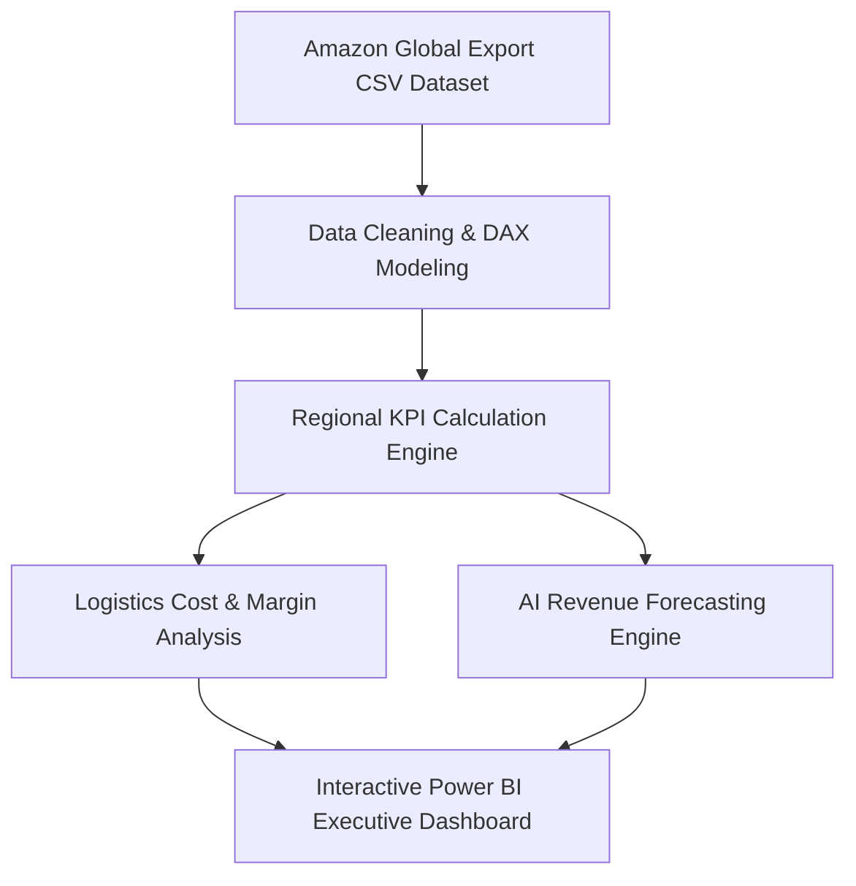

# 🛒 Amazon Global Export & Cross-Border Trade Dashboard

[](https://github.com/sharvesh-analytics)
[](https://github.com/sharvesh-analytics)
[](https://github.com/sharvesh-analytics)
[](https://opensource.org/licenses/MIT)

> **An executive cross-border trade analytics dashboard evaluating international shipping profitability, country-wise revenue growth, freight logistics costs, product category margins, and AI revenue forecasting for global sellers.**

---

## 📸Executive Visual Preview

<div align="center">
  
  
</div>

<br />

<div align="center">
  
</div>

---

## 📌 Executive Summary

Expanding e-commerce sales across international borders requires real-time intelligence into cross-border logistics, tariff impacts, shipping overheads, and currency fluctuations. This dashboard provides **Amazon Global Trade operational managers** with:
- **Country Revenue & Profit Metrics**: Country-by-country breakdown of total export sales, gross profit, and unit volumes.
- **Logistics & Freight Efficiency Analysis**: Evaluation of shipping cost percentages vs. product revenue margins.
- **Product Category Analytics**: Identification of high-performing export categories (Electronics, Apparel, Home Goods).
- **Predictive AI Revenue Forecasting**: Forecasting next-quarter export demand and optimal inventory stock levels.

---

## 🛠️ Data Architecture & Pipeline



---

## 📈 Key KPIs Tracked

- **Total Export Revenue**: Cumulative monetary value of cross-border orders.
- **Country Export Performance**: Top performing destination markets and sales volume growth.
- **Freight & Logistics Ratio**: Transport overhead vs. total margin percentage.
- **Product Category Profitability**: Net profit breakdown per product catalog segment.

---

## ⚡ Setup & Usage

### Prerequisites
- [Power BI Desktop](https://powerbi.microsoft.com/)

### Instructions
1. Clone this repository:
   ```bash
   git clone https://github.com/sharvesh-analytics/Amazon-Global-Export-Cross-Border-Trade-Dashboard.git
   ```
2. Open [`Amazon Global Export & Cross-Border Trade Dashboard.pbix`](<Amazon Global Export & Cross-Border Trade Dashboard.pbix>) in Power BI Desktop.
3. Dataset file [`Amazon_Global_Export_Cross_Border_Trade.csv`](Amazon_Global_Export_Cross_Border_Trade.csv) contains raw order records, shipping modes, country codes, and profit margins.

---

## 📜 License

Distributed under the MIT License. See `LICENSE` for details.

---

<div align="center">
  <sub>Designed & Developed by <b>Sharvesh Pandey</b> | Data Analyst & BI Specialist</sub><br/>
  <a href="https://www.linkedin.com/in/sharvesh-analytics"><b>LinkedIn</b></a> • <a href="https://github.com/sharvesh-analytics"><b>GitHub Profile</b></a>
</div>
